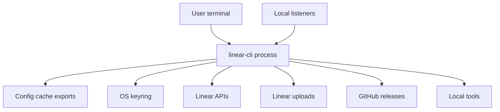

# linear-cli threat model

This document is a repo-grounded security overview for `linear-cli`. It is focused on the real runtime behavior of the CLI in this repository, not generic web-app risks.

Primary evidence anchors:

- `src/config.rs`
- `src/keyring.rs`
- `src/oauth.rs`
- `src/api.rs`
- `src/commands/auth.rs`
- `src/commands/webhooks.rs`
- `src/commands/uploads.rs`
- `src/commands/update.rs`
- `src/commands/export.rs`
- `src/commands/import.rs`
- `src/vcs.rs`
- `src/commands/git.rs`
- `src/output.rs`
- `src/text.rs`

## 1. Overview

`linear-cli` is a Rust-based command-line client for Linear.app. It uses API keys or OAuth 2.0, with optional OS keyring storage, to access Linear's GraphQL API and perform issue, project, document, import/export, webhook, upload, and automation workflows. It also integrates with local tooling such as `git`, `jj`, `gh`, `cargo`, and browser-opening helpers through direct subprocess execution.

Most operations run locally and make outbound HTTPS requests to Linear or GitHub. Inbound network exposure only exists when the user explicitly runs the OAuth callback flow or the optional webhook listener. The codebase is written in memory-safe Rust, which meaningfully reduces memory-corruption risk, but the main security concerns are still credential leakage, unsafe local environment assumptions, untrusted network and file input, terminal-safety issues, and supply-chain or subprocess abuse.

Key assets:

- API keys from `LINEAR_API_KEY` or config storage
- OAuth access and refresh tokens
- webhook secrets
- exported Linear data, which may include internal roadmap data or PII
- local cache and update-state files
- the local git/jj/gh environment and PATH-resolved binaries

## 2. Threat model, trust boundaries and assumptions

### Trust boundaries

- **Local process vs remote services:** The CLI sends outbound HTTPS requests to `api.linear.app`, `linear.app` OAuth endpoints, `uploads.linear.app`, and the GitHub release API. Responses are untrusted and parsed locally. Evidence: `src/api.rs`, `src/oauth.rs`, `src/commands/update.rs`.
- **Local process vs local disk/keyring:** Config, cache, update state, imported files, and exported files live under the user's config directory or chosen output paths, while optional secure storage uses the OS keyring. Evidence: `src/config.rs`, `src/cache.rs`, `src/keyring.rs`, `src/commands/export.rs`, `src/commands/uploads.rs`.
- **CLI vs optional local HTTP listeners:** OAuth and webhook features temporarily accept inbound HTTP traffic and must reject malformed or unauthorized requests. Evidence: `src/oauth.rs`, `src/commands/webhooks.rs`.
- **CLI vs external commands:** `git`, `jj`, `gh`, `cargo`, and platform open helpers are launched via `Command::new(...)` and inherit the operator's PATH trust assumptions. Evidence: `src/vcs.rs`, `src/commands/git.rs`, `src/commands/update.rs`, `src/commands/auth.rs`, `src/commands/issues.rs`.

### Attacker-controlled inputs

- CLI arguments, stdin, and environment variables such as `LINEAR_API_KEY` and `LINEAR_CLI_PROFILE`
- CSV and JSON import files plus arbitrary export destination paths
- issue titles, descriptions, comments, and other Linear data created by other workspace users
- webhook HTTP requests when `linear-cli webhooks listen` is running
- OAuth callback requests sent to localhost during OAuth login
- GitHub release metadata consumed by `linear-cli update`
- PATH-resolved binaries if the local machine is hostile

### Operator-controlled inputs

- config file contents and profile selection
- whether secrets are shown raw, including `config get --raw` and `--show-secret`
- webhook bind address, port, and public URL
- whether self-update is used at all
- chosen import and export file paths

### Developer-controlled inputs

- compile-time feature flags such as `secure-storage`
- release contents and package metadata
- test coverage and documentation accuracy

### Assumptions

- TLS to Linear and GitHub is not subverted.
- Linear's backend enforces authorization and workspace isolation; this CLI does not add a second authorization layer.
- The user's OS file permissions and keyring protections are meaningful.
- PATH-resolved external binaries are trusted by the operator.
- This document models runtime behavior, not CI or GitHub Actions hardening.

## 3. Attack surface, mitigations and attacker stories

### Authentication and secret handling

- **Surface:** API keys and OAuth tokens are loaded from environment variables, config storage, or OS keyring entries. Evidence: `src/config.rs`, `src/keyring.rs`, `src/commands/auth.rs`, `src/api.rs`.
- **Mitigations present:** Config writes, cache writes, update-state writes, export files, and upload downloads use atomic temp-file replacement and `0600` permissions on Unix where implemented. OAuth refresh flows persist rotated tokens. Keyring-backed storage is supported through the optional `secure-storage` feature. Human-readable config display paths consistently mask API keys unless the user explicitly requests raw secret output. Evidence: `src/config.rs`, `src/cache.rs`, `src/commands/export.rs`, `src/commands/uploads.rs`, `src/commands/update.rs`.
- **Attacker story:** Malware or another local user reads `~/.config/linear-cli/config.toml` or exported JSON/CSV files and steals API keys or sensitive Linear content. This remains a high-severity local compromise path, with OS keyring storage reducing but not eliminating exposure. The CLI now avoids long-lived API-key entrypoints on argv for config and workspace setup flows, which reduces shell-history and process-list leakage.

### Network and API interactions

- **Surface:** GraphQL queries and mutations to Linear, raw API commands, OAuth token exchange and refresh, upload downloads, and GitHub latest-release checks. Evidence: `src/api.rs`, `src/commands/api.rs`, `src/oauth.rs`, `src/commands/update.rs`, `src/commands/uploads.rs`.
- **Mitigations present:** Fixed service endpoints, explicit timeouts on the main Linear API client, OAuth token exchange client, and release-check client, explicit non-retry behavior for GraphQL mutations, and upload URL validation plus redirect restrictions that only allow `https://uploads.linear.app` over the default HTTPS port. The `reqwest` transport uses Rustls with platform-native certificate discovery, which preserves system-trusted roots needed in proxied environments that install local trust anchors. Evidence: `src/api.rs`, `src/oauth.rs`, `src/commands/update.rs`, `Cargo.toml`.
- **Attacker story:** An attacker tricks a user into fetching a malicious file or abusing an upload URL as an SSRF primitive. Host, scheme, credential, and redirect validation narrow this substantially, but the CLI still streams arbitrary-size successful responses to disk or stdout, so large-download DoS remains possible.

### OAuth callback server

- **Surface:** Temporary local HTTP listener used during `linear-cli auth oauth`. Evidence: `src/oauth.rs`, `src/commands/auth.rs`.
- **Mitigations present:** The listener binds to `127.0.0.1`, only accepts a single callback connection, enforces a 5-minute overall timeout and per-read timeout, only accepts `GET` requests for the exact `/callback` endpoint, validates the `state` value, uses PKCE, and HTML-escapes reflected OAuth error text. Evidence: `src/oauth.rs`.
- **Attacker story:** A local adversary or malicious local process tries to race the callback request or inject an attacker-controlled code value. State validation and PKCE block straightforward CSRF-style token injection, so exploitation would require stronger local compromise.

### Webhook listener

- **Surface:** Optional local HTTP listener for `linear-cli webhooks listen`, with a configurable bind address and optional public tunnel URL. Evidence: `src/commands/webhooks.rs`.
- **Mitigations present:** HMAC-SHA256 verification via `linear-signature`, constant-time verification through the HMAC implementation, `POST`-only handling for the exact `/webhook` endpoint, 8 KB header limit, 1 MB body limit, read timeouts, JSON parsing checks, and cleanup of the temporary Linear webhook on shutdown or some startup failures. Evidence: `src/commands/webhooks.rs`.
- **Attacker story:** If a user binds to `0.0.0.0` behind a public tunnel, an attacker can send repeated connection attempts or oversized requests to consume local resources. Signature checks prevent forged event processing, but availability remains a medium-risk concern for long-running listeners exposed to the internet.

### External command execution and VCS integration

- **Surface:** The CLI launches `git`, `jj`, `gh`, `cargo`, and URL-opening helpers without a shell. Evidence: `src/vcs.rs`, `src/commands/git.rs`, `src/commands/update.rs`, `src/commands/auth.rs`, `src/commands/issues.rs`.
- **Mitigations present:** Commands are built with `Command::new(...)` rather than shell interpolation, generated branch names are normalized to kebab-case and validated with `git check-ref-format --branch`, and the pager path only trusts a small set of bare executable names instead of arbitrary path-based overrides from `PAGER`. Evidence: `src/vcs.rs`, `src/main.rs`.
- **Attacker story:** A hostile PATH injects a malicious `git`, `cargo`, or `gh` binary, or a compromised local environment tampers with the update path. This is not a remote exploit from Linear data, but it is a credible local code-execution risk if the operator's environment is already compromised.

### File import, export, cache, and update state

- **Surface:** CSV and JSON import files, CSV/JSON/Markdown exports, per-profile cache files, and update-state tracking. Evidence: `src/commands/import.rs`, `src/commands/export.rs`, `src/cache.rs`, `src/commands/update.rs`.
- **Mitigations present:** CSV export sanitizes spreadsheet formula-leading characters, and several sensitive local files are written with `0600` permissions on Unix. Cache entries are scoped by profile. Evidence: `src/commands/export.rs`, `src/cache.rs`, `src/commands/update.rs`.
- **Attacker story:** A user exports PII or internal issue data to a shared location, or re-imports maliciously crafted CSV/JSON created by another party. The CLI reduces some risk with file permissions and CSV cell sanitization, but it cannot stop operator-selected file sharing or intentionally malicious import content.

### Output rendering and terminal safety

- **Surface:** Human-oriented command output prints issue titles, descriptions, comments, webhook data, and other workspace-controlled strings directly to the terminal. Evidence: `src/output.rs`, `src/text.rs`, multiple command handlers such as `src/commands/issues.rs` and `src/commands/webhooks.rs`.
- **Mitigations present:** Markdown stripping and terminal-control neutralization run before human-oriented rendering paths print untrusted workspace content, including issue detail, comment, team, template, and webhook rendering paths, which reduces ANSI escape and control-sequence abuse in normal CLI output. Evidence: `src/text.rs`, `src/commands/issues.rs`, `src/commands/comments.rs`, `src/commands/teams.rs`, `src/commands/templates.rs`, `src/commands/webhooks.rs`.
- **Attacker story:** A malicious workspace member creates issue titles or descriptions containing escape sequences that spoof prompts, rewrite terminal lines, or attempt clipboard-oriented escape abuse in capable terminals. This is a medium-severity local display and operator-trust issue rather than a server-side compromise.

### Update workflow

- **Surface:** `linear-cli update` checks GitHub Releases and then runs local Cargo tooling. Evidence: `src/commands/update.rs`.
- **Mitigations present:** The command plan is explicit, draft and prerelease GitHub releases are rejected, and the updater launches `cargo` directly rather than executing a shell string. Installation only runs through the explicit `linear-cli update` command path rather than opportunistically from unrelated commands. Evidence: `src/main.rs`, `src/commands/update.rs`.
- **Attacker story:** A compromised local Cargo installation, hostile PATH, or supply-chain compromise could turn a user-initiated update into execution of attacker-controlled code. This is a supply-chain and local trust problem, not an unauthenticated network-RCE path in the CLI itself.

### Out-of-scope or low-relevance classes

- The CLI is not a multi-tenant server and does not maintain browser sessions, so classic web-app issues such as XSS, session fixation, or CSRF are mostly out of scope except for the local OAuth and webhook listeners.
- Authorization is primarily enforced by Linear's backend API. The CLI assumes the authenticated caller is allowed to perform the requested action.
- Memory-corruption classes are substantially reduced by Rust's safety model, though unsafe local dependencies and subprocess behavior can still matter in practice.

## 4. Criticality calibration

### Critical

- Remote code execution from network inputs such as webhook payloads, OAuth callbacks, or Linear-created content without meaningful user interaction
- Exfiltration of API keys or OAuth tokens to an attacker-controlled endpoint through a bypass of upload URL restrictions or auth handling
- An update flow that installs attacker-controlled code without user intent or without running through trusted local Cargo tooling

### High

- Local credential disclosure caused by weak file permissions, unsafe raw secret display, or keyring misuse
- OAuth state or PKCE bypass allowing token theft or token injection
- Command injection into `git`, `gh`, `jj`, or `cargo` from untrusted input or generated branch names

### Medium

- Terminal escape injection from untrusted Linear issue or comment content
- DoS through large webhook traffic, repeated webhook connections, or large successful upload downloads
- Leakage of sensitive Linear data through caches or exported files due to operator error or shared-machine access
- Local environment abuse through PATH-resolved binaries when the machine is already hostile

### Low

- Minor information leaks in non-sensitive diagnostics, profile names, or cache metadata
- Non-security bugs in filtering, pagination, formatting, or issue-resolution behavior
- User-confirmed phishing risk from opening URLs that came from workspace content or Linear metadata

## Focus paths for manual review

- `src/config.rs` — secret precedence, config masking, and file-permission behavior
- `src/keyring.rs` — keyring fallback and secure-storage behavior
- `src/oauth.rs` — localhost callback parsing, state validation, PKCE, and error reflection
- `src/api.rs` — auth refresh, GraphQL transport, upload URL validation, and redirect policy
- `src/commands/auth.rs` — OAuth storage, browser-open flow, and token revocation
- `src/commands/webhooks.rs` — listener exposure, signature checks, and request parsing
- `src/commands/update.rs` — GitHub release trust, updater selection, and Cargo invocation
- `src/commands/uploads.rs` — file-write behavior for downloaded upload content
- `src/commands/export.rs` — export file permissions and CSV formula sanitization
- `src/commands/import.rs` — untrusted file parsing and object creation from operator-supplied data
- `src/vcs.rs` — branch-name normalization and local command execution
- `src/text.rs` — markdown stripping without terminal control-sequence neutralization
